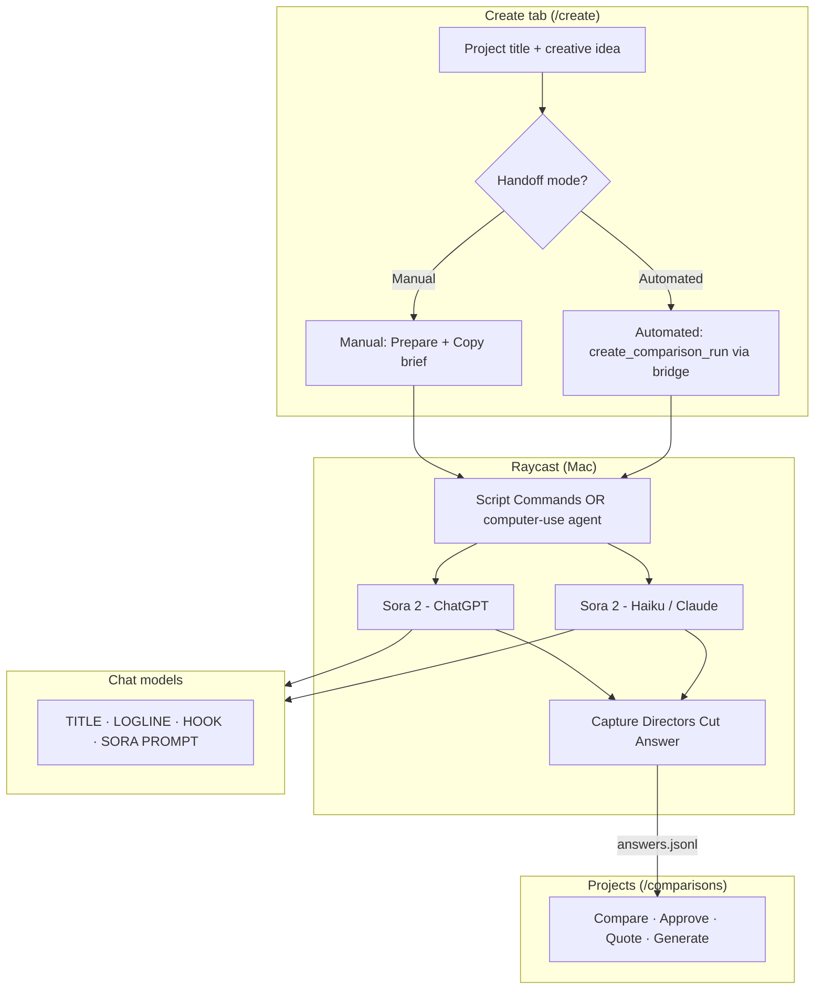

# Directors Cut

Creative intelligence workspace for AI video: ideate concepts, compare ChatGPT and Claude answers via Raycast, approve winners, generate Sora video, and promote specs into a reusable library.

**Dev app:** `http://127.0.0.1:5191` · `bun run dev` (reads the live server catalog)
**Companion repo:** [raycast-pro-bridge](https://github.com/) — Raycast Script Commands + HTTP bridge on `:8787`

Full project map and status: [`docs/STATUS.md`](docs/STATUS.md)

---

## Create → Raycast → Projects workflow

The **Create** tab supports two handoff modes:

| Mode | Who drives Raycast | Best for |
|------|-------------------|----------|
| **Automated** | Bridge creates the run · Cursor agent captures via computer use | Default — hands-off capture |
| **Manual** | You copy the brief · Raycast Script Commands | Debugging, offline, or no bridge token |

The **Creative idea** field is your seed brief for ChatGPT/Claude — not the final Sora prompt.



### What each field on Create means

| Field | Purpose |
|-------|---------|
| **Project title** | Name for the comparison run folder and Raycast argument 1 |
| **Creative idea** | Your rough brief — premise, tone, constraints. **Not** the final video prompt |
| **Output / Duration / Integrated sound** | Rules the app adds when wrapping the brief |
| **Visual reference** | Optional; skip for a clean text-only first pass |
| **Prepare Raycast concept run** | Builds the full brief with delivery rules (one integrated 12s Sora prompt, audio in-prompt, no shot list) |

### Step-by-step (one thing at a time)

**Automated (default)**

1. **Create** — Enter title + idea. Leave **Automated** selected.
2. **Create** — Click **Start automated concept run** (needs bridge token in `.env.local`).
3. **Cursor** — Say: `Capture concept run <run-id> with computer use` (see `.cursor/skills/raycast-concept-capture/`).
4. **Projects** — Open the run, compare concepts, **Approve** the winner.
5. **Projects** — **Get live quote** → **Confirm and generate** when ready.

**Manual**

1. **Create** — Select **Manual**, enter title + idea.
2. **Create** — **Prepare Raycast concept run** → **Copy for Raycast**.
3. **Raycast** — **Start Directors Cut Concept Run** (title arg 1, blank arg 2).
4. Paste into ChatGPT → **Capture** → repeat for Claude.
5. **Projects** — Review, approve, generate as above.

### What not to click

- The gray **Generate** buttons inside empty Sora/Seedance video cells are **disabled placeholders**. They do not start generation.
- Real generation lives in the **Approval** column: Approve → Get live quote → Confirm and generate.

### Valid model output shape

Each captured answer should be a `creative_concept_v1` package:

- **TITLE**
- **LOGLINE**
- **HOOK**
- **SORA PROMPT — 12 SECONDS** — one integrated prompt with imagery, action, sound, and title payoff

Invalid: shot lists, multiple prompt options, or claims that video was already generated.

---

## Repo layout

```text
src/                 SvelteKit app
content/cards/       Prompt library (target: Sora video specs)
content/comparisons/ Raycast-captured comparison runs
public/data/         Generated build indexes (not the live project catalog)
static/data/         Generated copy for SvelteKit assets (no symlink required)
docs/                STATUS, plans, handoffs
schemas/             JSON schemas for cards and runs
```

---

### Bridge setup (automated + Projects generate)

```bash
# raycast-pro-bridge
export DIRECTORS_CUT_PATH=~/Documents/Github/directors-cut
export RAYCAST_BRIDGE_TOKEN=your-token
bun src/server.ts

# directors-cut — copy .env.example to .env.local and set the same token
cp .env.example .env.local
bun run dev
```
