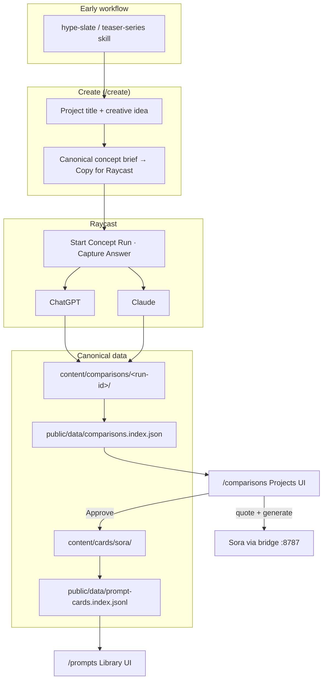

# Directors Cut — Status & Project Map

> **Last updated:** 2026-08-16  
> **Purpose:** Single source of truth for what this repo is, where we are, and what comes next.

---

## Main goal

**Turn strong creative ideas into reusable, testable Sora video specs — and browse them in a focused web app.**

Directors Cut is not a production repo for individual shows or commercials. It is the **creative intelligence layer**:

1. **Ideate** — slate and package concepts (`hype-slate/`, teaser-series skill)
2. **Compare** — capture real ChatGPT + Claude answers via Raycast (`/create` → Script Commands → `/comparisons`)
3. **Generate** — submit approved concepts to Sora through the bridge (when configured)
4. **Library** — promote winners into **Sora library video specs** in `content/cards/sora/` for reuse

The generated video is the deliverable in the comparison slice. The **library spec** is the long-term asset once an idea proves out.

---

## What lives here vs elsewhere

| In **directors-cut** | Elsewhere |
|----------------------|-----------|
| Svelte app (`src/`) | **super-seed2** — production projects (Blood Rush, TinyParka, etc.) |
| Prompt & comparison data (`content/`) | **raycast-pro-bridge** — Raycast Script Commands + HTTP bridge |
| Schemas, index builders, docs | |
| Early workflow: `hype-slate/`, `skillset/02-teaser-series-package/` | |
| Vendored agent skills (`skillset/imported-skills/`) | |

**Rule:** Only keep content this app creates or curates (Raycast runs, prompt cards, hype-slate workflow). Production project trees do not belong here.

---

## System map

Step-by-step Create workflow (with diagram): [`README.md`](../README.md#create--raycast--projects-workflow)



**Dev app:** `http://localhost:5190` · `bun run dev`  
**Bridge (optional):** `VITE_RAYCAST_BRIDGE_URL` + `VITE_RAYCAST_BRIDGE_TOKEN` → `http://127.0.0.1:8787`

---

## Web app routes

| Route | Role |
|-------|------|
| `/create` | Build Raycast brief for 12s Sora concept run |
| `/comparisons` | Projects — compare runs, approve concepts, quote/generate |
| `/prompts` | Library — browse prompt cards (target: Sora video specs) |
| `/` | Dashboard — stats, latest media |
| `/pilots/camera-moves` | Techniques placeholders (experimental) |
| `/sources` | Reference repo index |

---

## Current state (2026-08-16)

### Shipped

- **Library:** 10 prompt cards (4 Sora, 3 Seedance, 3 cross-model) — mostly templates, **0 tested by us**
- **Projects:** 3 comparison runs indexed
  - **NIGHT SHIFT 2004 E2E** — ChatGPT + Claude captured; no video yet
  - **Pink Room** — 2 Sora videos ingested
  - **Sora Vice** — text answers; generation blocked by billing
- **Create → Raycast** vertical slice (brief copy, concept package schema)
- **Comparison UI** — media preview, lightbox, version cells, concept approval + generation gating (partial WIP uncommitted in `src/`)
- **hype-slate** — 40-concept slate + 4 Stage-3 packages (early app workflow)
- **Seedance 2.0** skill vendored at upstream v6.7.0

### Not done

| Area | Gap |
|------|-----|
| **Sora library video specs** | Cards exist as adapted templates; no promoted specs from real runs yet |
| **Create persistence** | New runs still require manual JSONL / Raycast script rebuild |
| **Bridge in UI** | Needs `.env.local` token for quote/generate on Projects |
| **Review actions** | Keep / Iterate / Extend / Reject — placeholders |
| **Vision score** | Placeholder |
| **Docs** | `TODO.md` still reflects July Phase 1 checklist |

### Uncommitted local work

- `src/` — comparison generation UI refinements
- `.cursor/skills/seedance-25-prompt/` — generic 2.5 grammar (untracked)

---

## Near-term priority (user direction)

**After solid ideas land in Projects, build out the Sora library video specs first.**

Intended flow:

1. Run comparison slice on strong concepts (Raycast → approve → generate → review video)
2. Mark what works (human rating, production readiness)
3. **Promote** winning prompts + container settings into `content/cards/sora/` as first-class **video specs**
4. Browse and reuse specs from `/prompts` Library

Open product questions — **decisions (2026-08-16 interview):**

| Question | Decision |
|----------|----------|
| What is a Sora library video spec? | **Minimal:** final Sora prompt text + duration/size (12s, 720p, 16:9) |
| When does an idea promote to the library? | **Approve** on the Projects row is enough — adds the spec to the Library table (prompt + 12s / 720p / 16:9). Video can follow. |
| Where do solid ideas come from? | **Both** hype-slate packages and `/create` → Raycast one-offs |
| Library scope | **Sora first**; keep existing Seedance/cross-model cards browsable |
| First spec categories | **Netflix teaser**, **series sizzle**, **commercial** |

**Build order implied:**

1. Fresh brief on `/create` → Raycast capture → `/comparisons` review
2. **Approve** winning concept → appears in `/prompts` Library table
3. Generate Sora video (bridge) → attach test run when ready
4. Repeat; expand categories: Netflix teaser → series sizzle → commercial

**Next E2E test:** Walk through a **new** concept from `/create` through Raycast (not Pink Room — already has videos). NIGHT SHIFT 2004 is the prior test run (concepts only, no Sora yet); use it as reference, then draft fresh.

---

## Comparison runs (live data)

| Run ID | Title | Status | Artifacts |
|--------|-------|--------|-----------|
| `20260815-085327-night-shift-2004-e2e` | NIGHT SHIFT 2004 | answers_collected | 0 videos |
| `2026-07-pink-room-two-part-teaser-001` | THE PINK ROOM | partially_generated | 2 Sora MP4s |
| `2026-07-sora-vice-teaser-001` | Sora Vice | answers_collected | billing blocked |

---

## Sora library today (`content/cards/sora/`)

| Card | Focus | Tested |
|------|-------|--------|
| Netflix Teaser Cinematic Continuity | Continuous camera, title in-world | No |
| Director Style Editing Matrix | Edit rhythm / director study | No |
| Audio-First Micro Documentary | Sound-led observational | No |
| World-Simulator Physics Loop | Physical coherence loop | No |

These are **templates**. The goal is to grow this folder with **specs backed by real comparison runs and renders**.

---

## UI smoke test

```bash
cd ~/Documents/Github/directors-cut
bun run check
bun run dev    # → http://localhost:5190
```

| Check | Route | Expect |
|-------|-------|--------|
| Dashboard | `/` | 10 cards, latest Pink Room previews |
| Library | `/prompts` | Table + drawer + copy |
| Projects | `/comparisons` | 3 runs, NIGHT SHIFT concepts |
| Create | `/create` | Brief builder + Raycast handoff |
| Mobile nav | any | Hamburger drawer |

Full E2E requires Raycast + bridge env — see `HANDOFF.md`.

---

## Key files

| Doc / path | Role |
|------------|------|
| `HANDOFF.md` | Raycast → Sora vertical slice |
| `docs/comparison-lab-requirements.md` | Projects UI spec |
| `docs/ui-ux-handoff.md` | Visual browser wireframes |
| `docs/directors-cut-deep-dive-plan.md` | Full roadmap (historical phases) |
| `docs/TODO.md` | Task backlog (needs refresh) |
| `content/cards/` | Library source of truth |
| `content/comparisons/` | Project run source of truth |
| `schemas/prompt-card.schema.json` | Card frontmatter contract |
| `schemas/generation-prompt.schema.json` | Concrete generation prompts |

---

## Repos

- `github.com/gordo-v1su4/directors-cut` — this repo
- `github.com/gordo-v1su4/raycast-pro-bridge` — Raycast + bridge
- `github.com/gordo-v1su4/super-seed2` — production generation projects

---

## Historical note

Sections below Phase 0 in older commits described Hermes handoff from July 2026. Phase 0–2 baselines are complete. Treat **Sora library video specs** and **comparison → promote** as the active product thread unless decisions say otherwise.
